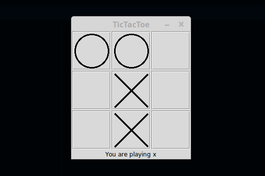

Python Tic Tac Toe
===============
> Console and Tkinter versions of the classic.



Summary:
-----------------
This project was a revamp of one of the first large projects I ever attempted in
C++. I was able to take it a few steps further and make the AI cleaner, more 
object oriented, and I designed a clean tkinter GUI for playing. 

### Prerequisities
Python 3

## Running:
### Console run
``` 
$ python3 main <mode>
```
mode is either 'console' or 'gui' depending on which interface you want to use.


## Release History
* 0.0.1

## Meta
Author: Erik Lunna
Date Started: 04-04-16
Date finished: 09-22-16
Socials – [@hackponies](https://twitter.com/hackponies) – eslunna@gmail.com
[https://github.com/lunatunez/tictactoe](https://github.com/lunatunez/)

## Contributors

* How they can dive into the project (issue trackers, IRC, twitter accounts)
* Testing, bug hunting

## License

Distributed under the XYZ license. See ``LICENSE.txt`` for more information.


## TODO
-----------------
* Highlight the winning row at the end of the game.
* Enable support for scoring larger tictactoe boards (4x4 - 10x10)
* Add a menu - with File, Newgame, exit, Help, credits, etc.
